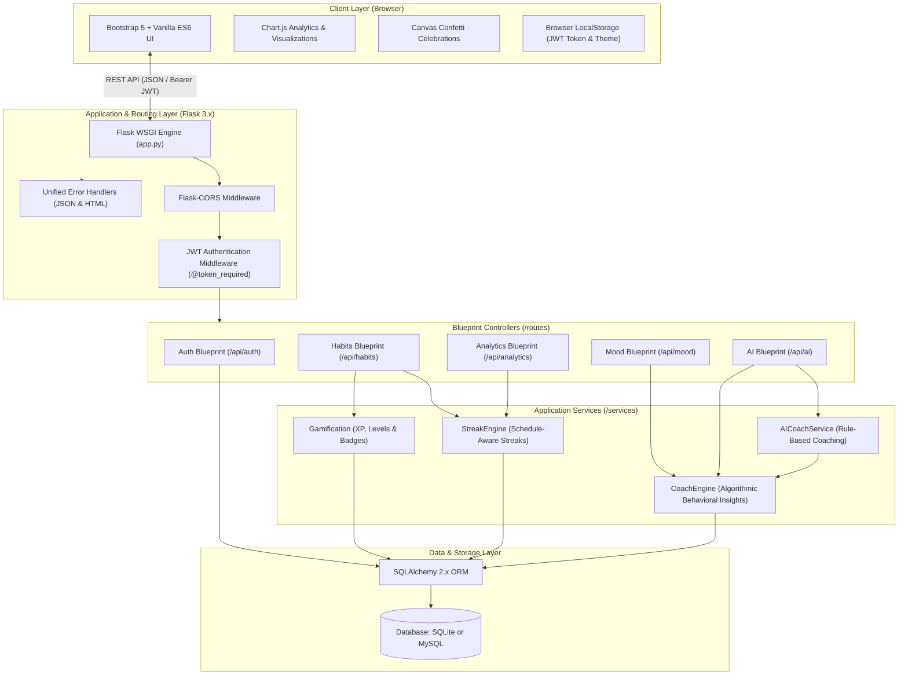
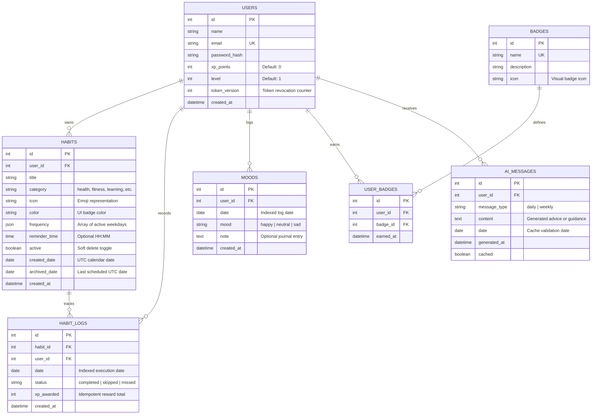
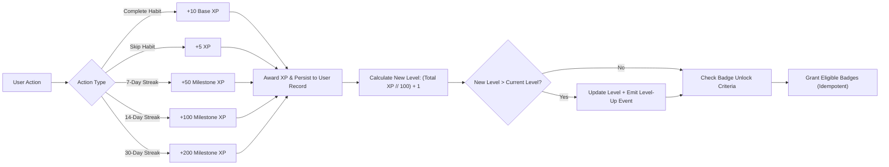
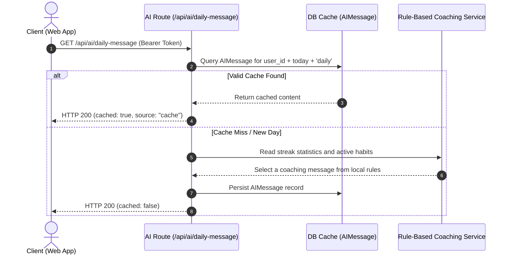
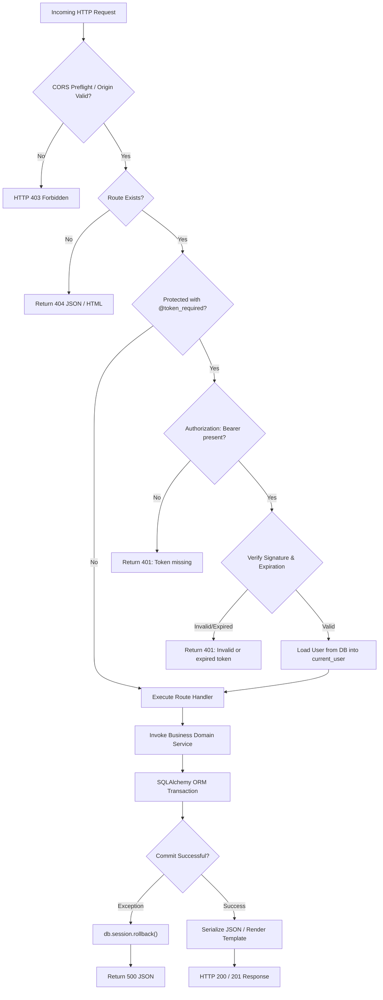
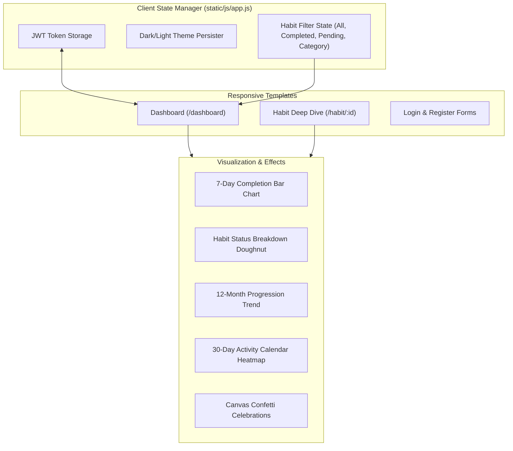
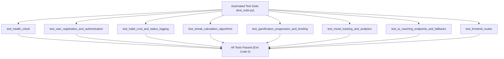

# HabitFlow v3.0.3

> **HabitFlow v3.0.3** is a personal habit tracker built with Flask, SQLAlchemy, and a responsive browser interface. It supports scheduled habits, streaks, completion history, mood check-ins, badges, and rule-based coaching.

---

## Table of Contents

1. [Executive Overview & Key Highlights](#executive-overview--key-highlights)
2. [High-Level System Architecture](#high-level-system-architecture)
3. [Component & Layered Architecture](#component--layered-architecture)
4. [Database Design & Entity-Relationship Model](#database-design--entity-relationship-model)
5. [Core Algorithms & Business Logic](#core-algorithms--business-logic)
   - [Streak Calculation Engine & Grace Periods](#streak-calculation-engine--grace-periods)
   - [Gamification, Experience (XP) & Leveling](#gamification-experience-xp--leveling)
   - [Behavioral Science & Coaching Engine](#behavioral-science--coaching-engine)
   - [Mood and Habit Pattern Comparison](#mood-and-habit-pattern-comparison)
6. [Authentication, Security & Hardening](#authentication-security--hardening)
7. [End-to-End Request Lifecycle](#end-to-end-request-lifecycle)
8. [Comprehensive REST API Reference](#comprehensive-rest-api-reference)
9. [Frontend Architecture & User Experience](#frontend-architecture--user-experience)
10. [Automated Testing Suite](#automated-testing-suite)
11. [Installation, Configuration & Deployment](#installation-configuration--deployment)
12. [Repository Directory Structure](#repository-directory-structure)
13. [Authors and Connect](#authors-and-connect)
14. [Contributing & License](#contributing--license)

---

## Executive Overview & Key Highlights

HabitFlow was built from the ground up to solve the most common challenges in digital habit tracking: rigid streak breakages, lack of context between emotional state and productivity, and uninspired user retention.

### Key Capabilities

* **Schedule-Aware Streak Engine:** Automatically differentiates between daily, weekday-only, and custom-scheduled habits. An unlogged habit today never breaks a streak prematurely due to a built-in grace period window.
* **Rule-Based Coaching:** Uses logged activity and simple heuristics to generate daily messages and recommendations. It does not use a remote AI model.
* **Mood & Habit Patterns:** Compares logged moods with scheduled habit completions. These comparisons describe patterns in a user's own records and do not establish cause and effect.
* **Gamified Progression:** Levels use the formula $\text{Level} = \lfloor \text{XP} / 100 \rfloor + 1$. XP comes from habit completions, streak milestones, and skipped habits.
* **Responsive Interface:** Uses Bootstrap 5, dark mode, Chart.js charts, activity heatmaps, search, and completion feedback.

HabitFlow uses **UTC calendar dates** for habit logs, streaks, mood check-ins, and analytics so browser headers cannot shift a user's logging day.

---

## High-Level System Architecture

HabitFlow uses a small Flask application with separate route, service, and model modules. SQLite is the default database; deployments can configure another SQLAlchemy-supported database.



---

## Component & Layered Architecture

HabitFlow separates page rendering, API routes, application services, and database models:

```mermaid
flowchart LR
    subgraph Presentation ["1. Presentation Layer"]
        Views["Jinja2 Web Views (/dashboard, /habit/id, /login)"]
        StaticAssets["CSS Themes, Chart.js, app.js"]
    end

    subgraph API_Routers ["2. API & Routing Layer"]
        Routes["RESTful Blueprints (Auth, Habits, Mood, Analytics, AI)"]
        Validators["Input Validation & Bearer Header Inspection"]
    end

    subgraph Domain_Services ["3. Business Domain Services"]
        SE["Streak Engine"]
        GE["Gamification Engine"]
        CE["Algorithmic Coach Engine"]
        BE["AICoachService"]
    end

    subgraph Data_Access ["4. Data Access Layer"]
        Models["Declarative ORM Models (User, Habit, HabitLog, Mood, Badge)"]
        Transactions["Atomic Sessions & Auto-rollback Protections"]
    end

    Presentation --> API_Routers
    API_Routers --> Domain_Services
    Domain_Services --> Data_Access
    Data_Access --> Storage[("SQLite / MySQL Engine")]
```



1. **Presentation Layer:** Jinja templates serve the page views. Browser JavaScript calls the API, updates the page, and manages Chart.js visualizations.
2. **API & Routing Layer:** Blueprints in `routes/` validate requests, verify JWTs, apply database-backed rate limits to sensitive authentication endpoints, and return JSON responses.
3. **Application Services:** Modules in `services/` calculate streaks and analytics, apply XP and badge rules, and generate rule-based coaching. They use the shared SQLAlchemy session.
4. **Data Access Layer:** SQLAlchemy models in `models.py` define relationships, uniqueness rules, and indexes. SQLite is the default database; MySQL is also supported.

---

## Database Design & Entity-Relationship Model

The relational database schema is structured for referential integrity, performant querying on dates and user scopes, and automated badge seeding.



### Constraints & Indexes
* **`HABIT_LOGS`:** Unique composite constraint `(habit_id, date)` ensures each habit is logged at most once per calendar date.
* **`MOODS`:** Unique composite constraint `(user_id, date)` enforces a single daily emotional check-in per user.
* **`USER_BADGES`:** Unique composite constraint `(user_id, badge_id)` guarantees badge award idempotency.
* **`AI_MESSAGES`:** Unique composite constraint `(user_id, message_type, date)` prevents duplicate cached messages for the same user, type, and date.

---

## Core Algorithms & Business Logic

### Streak Calculation Engine & Grace Periods

Traditional streak trackers fail if a user checks their app at 9:00 PM without having logged that day yet. HabitFlow solves this through a **two-phase schedule-aware grace period algorithm**.


### Streak Engine Rules
1. **Grace Period on Current Date:** If the habit is scheduled for today but not yet logged, the streak from yesterday remains intact. The streak only resets if yesterday was scheduled and neither completed nor excused.
2. **Frequency Filtering:** If a habit is configured for Monday through Friday, Saturday and Sunday are excluded from the required verification window and will not disrupt streaks.
3. **Excused Skips:** Logs marked as `skipped` preserve current streak momentum without incrementing the streak count.

---

### Gamification, Experience (XP) & Leveling

HabitFlow rewards continuous engagement through a transparent gamification engine.



#### Deterministic Level Progression Formula
$$\text{Level} = \left\lfloor \frac{\text{Total XP}}{100} \right\rfloor + 1$$

* $\text{XP} \in [0, 99] \implies \text{Level } 1$
* $\text{XP} \in [100, 199] \implies \text{Level } 2$
* $\text{XP} \in [200, 299] \implies \text{Level } 3$

#### Seeded Badges
| Badge | Description | Trigger Threshold |
| :--- | :--- | :--- |
| **First Week** | Complete a habit for 7 days straight | 7-day streak |
| **Two Weeks Strong** | Complete a habit for 14 days straight | 14-day streak |
| **Monthly Master** | Complete a habit for 30 days straight | 30-day streak |
| **Getting Started** | Log 10 habit completions | 10 completions |
| **Habit Builder** | Log 50 habit completions | 50 completions |
| **Centennial** | Log 100 habit completions | 100 completions |
| **Consistency King** | Log 200 habit completions | 200 completions |
| **Yearly Champion** | Log 365 habit completions | 365 completions |

---

### Behavioral Science & Coaching Engine

Daily coaching messages and habit recommendations are generated by local rule-based services. Daily messages are cached in the database for the current UTC calendar date.



---

### Mood and Habit Pattern Comparison

The mood summary compares completion rates for scheduled habit opportunities on days with logged happy moods and on days with logged neutral or sad moods:

$$\text{Happy-Day Completion Rate} = \frac{\text{Completions on Happy-Mood Days}}{\text{Scheduled Habit Opportunities on Happy-Mood Days}} \times 100$$

* Detects user's **Power Days** (weekdays with statistically highest completion frequency).
* Detects **Comeback Opportunities** (encouraging recovery after missed habits).
* These comparisons are descriptive and do not show that mood caused a habit completion or vice versa.

---

## Authentication, Security & Hardening

Security and defensive engineering are implemented at every layer:


### Security Hardening Measures
1. **Password Hashing:** Uses Werkzeug's password hashing with a per-user salt. Plaintext passwords are never stored or logged.
2. **JWT Token Lifecycle:** Tokens are signed using HMAC-SHA256 (`HS256`), containing explicit `exp` (30-day validity) and `iat` timestamps. The `@token_required` decorator validates signatures and expiration on protected routes.
3. **Cross-Site Scripting (XSS) Mitigation:** Client renderers escape user-controlled text before inserting it into HTML. Recommendations use event listeners rather than embedding values in inline JavaScript.
4. **SQL Injection Immunity:** All database operations utilize SQLAlchemy parameterized ORM queries; no raw SQL concatenations are used.
5. **CORS Configuration:** Development allows cross-origin requests; production restricts API origins to the configured HTTPS frontend URL.
6. **Graceful Error Masking:** Production exceptions are trapped by centralized HTTP handlers, preventing internal stack traces from leaking to clients.

---

## End-to-End Request Lifecycle



---

## Comprehensive REST API Reference

All protected API endpoints require the standard HTTP authorization header:
```http
Authorization: Bearer <your_jwt_token>
```

### 1. Authentication Endpoints

#### Register a New Account
```http
POST /api/auth/register
Content-Type: application/json

{
  "username": "sanyam",
  "email": "sanyam@example.com",
  "password": "SecurePassword123"
}
```
**Response (201 Created):**
```json
{
  "message": "Account registered successfully!",
  "token": "eyJhbGciOiJIUzI1NiIsInR5cCI6IkpXVCJ9...",
  "user": {
    "id": 1,
    "name": "sanyam",
    "email": "sanyam@example.com",
    "xp_points": 0,
    "level": 1,
    "created_at": "2026-10-01T12:00:00+00:00"
  }
}
```

#### User Login
```http
POST /api/auth/login
Content-Type: application/json

{
  "username": "sanyam",
  "password": "SecurePassword123"
}
```
**Response (200 OK):**
```json
{
  "message": "Login successful",
  "token": "eyJhbGciOiJIUzI1NiIsInR5cCI6IkpXVCJ9...",
  "user": {
    "id": 1,
    "name": "sanyam",
    "email": "sanyam@example.com",
    "xp_points": 140,
    "level": 2,
    "created_at": "2026-10-01T12:00:00+00:00"
  }
}
```

#### Fetch Current Profile
```http
GET /api/auth/profile
```
**Response (200 OK):**
```json
{
  "user": {
    "id": 1,
    "name": "sanyam",
    "email": "sanyam@example.com",
    "xp_points": 140,
    "level": 2,
    "created_at": "2026-10-01T12:00:00+00:00",
    "badges_count": 3,
    "habits_count": 5
  }
}
```

---

### 2. Habits Endpoints

#### List All User Habits
```http
GET /api/habits
```
**Response (200 OK):**
```json
{
  "count": 1,
  "habits": [
    {
      "id": 1,
      "title": "Morning Meditation",
      "category": "health",
      "icon": "mindfulness",
      "color": "primary",
      "frequency": ["monday", "tuesday", "wednesday", "thursday", "friday"],
      "reminder_time": "07:30",
      "active": true,
      "current_streak": 5,
      "longest_streak": 12,
      "total_completions": 28,
      "consistency_score": 86,
      "completion_rate": 80,
      "is_scheduled_today": true,
      "today_status": "completed"
    }
  ]
}
```

#### Create a Habit
```http
POST /api/habits
Content-Type: application/json

{
  "title": "Read 20 Pages",
  "category": "learning",
  "icon": "reading",
  "color": "success",
  "frequency": ["monday", "wednesday", "friday", "sunday"],
  "reminder_time": "21:00"
}
```

#### Log Habit Action (Complete, Skip, Miss)
```http
POST /api/habits/1/complete
Content-Type: application/json

{
  "date": "2026-10-02"
}
```
**Response (200 OK):**
```json
{
  "message": "Habit completed! Well done!",
  "status": "completed",
  "xp_earned": 10,
  "current_streak": 6,
  "badges_unlocked": []
}
```

---

### 3. Mood Tracking Endpoints

#### Check-in Daily Mood
```http
POST /api/mood
Content-Type: application/json

{
  "date": "2026-10-02",
  "mood": "happy",
  "note": "Felt productive, finished core refactoring."
}
```
**Response (200 OK):**
```json
{
  "message": "Mood logged successfully!",
  "mood": "happy",
  "label": "Happy",
  "date": "2026-10-02",
  "note": "Felt productive, finished core refactoring."
}
```

---

### 4. Coaching Endpoints

#### Get Daily Coaching Message
```http
GET /api/ai/daily-message
```
**Response (200 OK):**
```json
{
  "message": "Your routines add up. Choose one small action for today.",
  "cached": false,
  "generated_at": "2026-10-03T12:00:00+00:00",
  "source": "behavioral_engine",
  "error": null
}
```

---

## Frontend Architecture & User Experience

The HabitFlow frontend uses server-rendered Jinja pages with browser JavaScript for API calls, charts, and interactive updates.



### Highlights of UI/UX Implementation
* **Zero XSS Exposure:** Every dynamic content rendering into `.innerHTML` passes through an HTML character entity encoder (`escapeHtml`), preventing injection vulnerabilities.
* **Instant Habit Search:** Client-side real-time fuzzy search responds immediately to keystrokes without reloading or re-fetching.
* **Smart Filter Tabs:** Filter active habits by status (`All`, `Pending Today`, `Completed Today`) and by category (`Health`, `Fitness`, `Learning`, `Productivity`).
* **Visual Data Density:** Combines Chart.js graphs, 30-day activity calendar heatmaps, and consistency percentage meters for instant status recognition.
* **High-Contrast Theme & 1-Click Toggle:** Fully accessible WCAG AA-compliant high-contrast color system across dark and light modes, with a persistent 1-click theme toggle in the sticky navigation bar and synchronized state across sessions.

---

## Automated Testing Suite

HabitFlow includes a comprehensive unit and integration test suite (`test_suite.py`) covering all critical application subsystems.



### Running the Test Suite

```bash
# Activate your virtual environment
source venv/bin/activate

# Execute the test suite
python3 test_suite.py
```

### Verifying Code Quality and Linting

```bash
# Check for syntax errors, undefined names, and critical issues
flake8 . --count --select=E9,F63,F7,F82 --show-source --statistics
```

---

## Installation, Configuration & Deployment

### Quick Start (Local Development)

```bash
# 1. Clone repository
git clone https://github.com/KerberoSec/Sanyam_Hackathon_2nd_Rank.git
cd Sanyam_Hackathon_2nd_Rank

# 2. Run automated setup script (creates venv, installs dependencies, sets up .env)
chmod +x setup.sh
./setup.sh

# 3. Start the application
python3 app.py
```
Open [http://localhost:5000](http://localhost:5000) in your web browser.

---

### Environment Configuration (`.env`)

| Variable | Type | Default Value | Description |
| :--- | :--- | :--- | :--- |
| `FLASK_ENV` | String | `development` | Flask runtime environment (`development` or `production`) |
| `SECRET_KEY` | String | Required in production | Unique signing key of at least 32 characters |
| `JWT_SECRET_KEY` | String | Required in production | Separate unique JWT signing key of at least 32 characters |
| `DATABASE_URL` | String | `sqlite:///instance/habit_tracker.db` | SQLAlchemy connection URI (SQLite or MySQL) |
| `FRONTEND_URL` | URL | Required in production | HTTPS app URL for production CORS and allowed origins |
| `MAIL_SERVER` | String | Optional | SMTP host for system notifications (optional) |
| `MAIL_DEFAULT_SENDER` | String | Optional | Sender address for system notifications (optional) |
| `APP_HOST_BIND_ADDRESS` | IP address | `127.0.0.1` (Compose) | Host interface for the published Docker port; keep loopback behind a host reverse proxy |
| `TRUSTED_PROXY_COUNT` | Integer | `0` | Number of trusted proxies that sanitize forwarded client IP headers; only enable when direct access to the app port is blocked |

---

### Running with Docker & Docker Compose

Deploy HabitFlow with a single command using Docker Compose:

```bash
# Build and launch container in detached mode
docker compose up -d --build

# Inspect application container logs
docker compose logs -f habitflow

# Tear down container services
docker compose down
```

The containerized app includes health checks and a persistent SQLite data volume. Set independent `SECRET_KEY` and `JWT_SECRET_KEY` values and an HTTPS `FRONTEND_URL` in `.env` before starting production. The host port binds to loopback by default for use behind a host reverse proxy. To expose the app directly, set `APP_HOST_BIND_ADDRESS=0.0.0.0` and leave `TRUSTED_PROXY_COUNT=0`. When using a reverse proxy, keep the app port private and set `TRUSTED_PROXY_COUNT` to the number of trusted proxies.

---

### Production Deployment (Gunicorn + Nginx)

For high-concurrency production deployments:

```bash
# Install Gunicorn WSGI server
pip install gunicorn

# Load production secrets and HTTPS FRONTEND_URL from .env.
# The application port stays private behind the local Nginx proxy.
export FLASK_ENV=production
export TRUSTED_PROXY_COUNT=1
gunicorn -w 4 -b 127.0.0.1:5000 "app:create_app()"
```

`FLASK_ENV=production` enables production secret and HTTPS validation. For the single local Nginx proxy shown below, `TRUSTED_PROXY_COUNT=1` lets the authentication rate limiter use the sanitized client IP. Do not expose the Gunicorn port directly while trusting forwarded headers.

#### Sample Nginx Reverse Proxy Configuration
```nginx
server {
    listen 80;
    server_name habits.yourdomain.com;

    location / {
        proxy_pass http://127.0.0.1:5000;
        proxy_set_header Host $host;
        proxy_set_header X-Real-IP $remote_addr;
        proxy_set_header X-Forwarded-For $proxy_add_x_forwarded_for;
        proxy_set_header X-Forwarded-Proto $scheme;
    }
}
```

---

## Repository Directory Structure

```plaintext
HabitFlow/
├── app.py                     # Centralized application factory & error handlers
├── config.py                  # Environment-driven configuration & DB URI resolution
├── date_utils.py              # Centralized UTC calendar date utility helpers
├── models.py                  # SQLAlchemy declarative models & badge seed logic
├── requirements.txt           # Production Python dependency manifest
├── Dockerfile                 # Container image specification (Python 3.11-slim)
├── docker-compose.yml         # Container orchestration with volume mounts
├── setup.sh                   # One-click environment bootstrap script
├── test_suite.py              # Automated unit and integration test suite
├── README.md                  # Comprehensive architectural and system documentation
├── routes/                    # Modular REST Blueprint Controllers
│   ├── __init__.py            # Blueprint registry and package exports
│   ├── auth.py                # Registration, login, profile, and JWT issuance
│   ├── habits.py              # Habit CRUD, frequency verification, and action logs
│   ├── analytics.py           # Dashboard metrics, trends, and habit deep dives
│   ├── mood.py                # Mood check-ins, streaks, and correlation analytics
│   └── ai.py                  # AI coaching endpoints and response caching
├── services/                  # Application and domain services
│   ├── __init__.py            # Service layer registry and package exports
│   ├── streak_engine.py       # Schedule-aware streak calculation engine
│   ├── gamification.py        # XP formulas, leveling curves, and badge criteria
│   ├── coach_engine.py        # Algorithmic behavioral psychology heuristics
│   └── ai_coach.py            # Rule-based coaching and recommendation service
├── static/                    # Frontend Client Static Assets
│   ├── css/
│   │   ├── style.css          # Shared styles, accessible dark mode, and tactile 3D effects
│   │   └── landing.css        # Landing page layout and 3D hero scene
│   └── js/
│       ├── app.js             # Core frontend application logic, state, and API client
│       └── dashboard.js       # Backwards-compatibility adapter script
└── templates/                 # Jinja2 Semantic HTML Templates
    ├── base.html              # Base layout with responsive navigation & theme toggle
    ├── index.html             # Landing page with interactive hero and feature showcases
    ├── login.html             # Authentication: User sign-in
    ├── register.html          # Authentication: New user registration
    ├── dashboard.html         # Main dashboard with stats, habit list, AI coach & charts
    ├── habit_detail.html      # Habit deep-dive with calendar heatmap & edit modal
    ├── about.html             # About page with developer profiles and architecture overview
    ├── privacy.html           # Application privacy policy & data sovereignty documentation
    └── terms.html             # Application terms of service documentation
```

---

## Authors and Connect

Developed and maintained by **Arun Kumar**, **Sourav**, **Anish Thakur**, and **Paras Rana**.

HabitFlow is built with Flask, SQLAlchemy, SQLite or MySQL, Bootstrap, and browser JavaScript. It provides scheduled habit tracking, mood check-ins, analytics, XP and badges, and rule-based coaching.

### Connect

[](https://www.linkedin.com/in/arunkumar31072006/)
[](https://github.com/KerberoSec)
[](https://www.instagram.com/so_far_from_your_heart/)
[](https://x.com/ArunKumar310706)

| Platform | Profile Link | Handle |
| :--- | :--- | :--- |
| **LinkedIn** | [linkedin.com/in/arunkumar31072006](https://www.linkedin.com/in/arunkumar31072006/) | [Arun Kumar](https://www.linkedin.com/in/arunkumar31072006/) |
| **GitHub** | [github.com/KerberoSec](https://github.com/KerberoSec) | [@KerberoSec](https://github.com/KerberoSec) |
| **Instagram** | [instagram.com/so_far_from_your_heart](https://www.instagram.com/so_far_from_your_heart/) | [@so_far_from_your_heart](https://www.instagram.com/so_far_from_your_heart/) |
| **X / Twitter** | [x.com/ArunKumar310706](https://x.com/ArunKumar310706) | [@ArunKumar310706](https://x.com/ArunKumar310706) |

---

## Contributing & License

Contributions are welcome! Please feel free to submit a Pull Request or open an Issue.

This project is licensed under the MIT License, see the [LICENSE](LICENSE) file for details.
