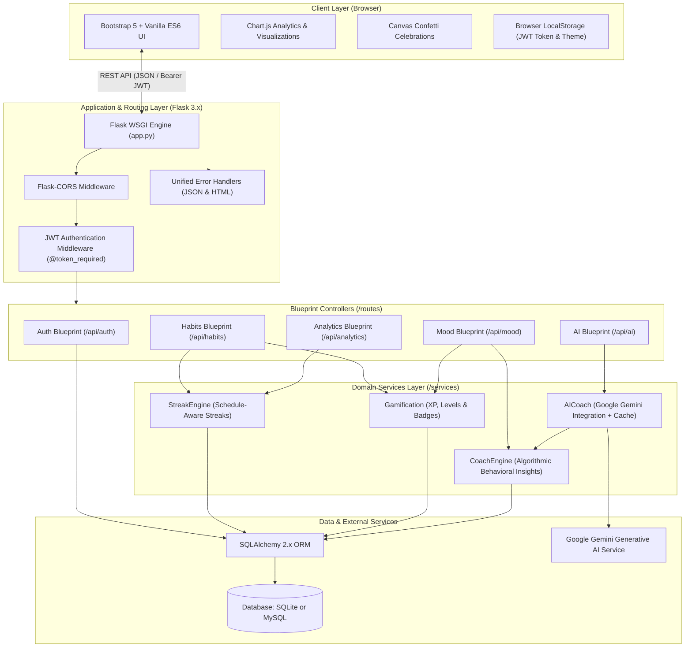
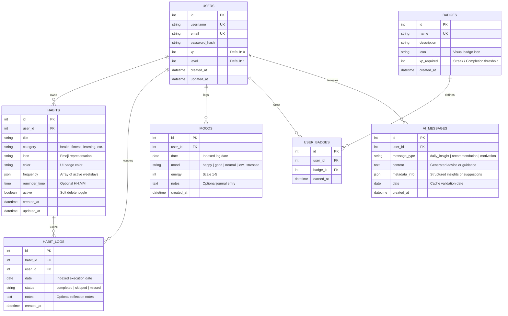
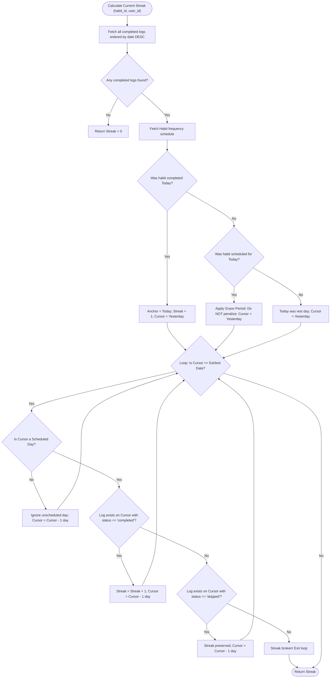
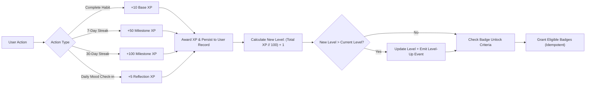
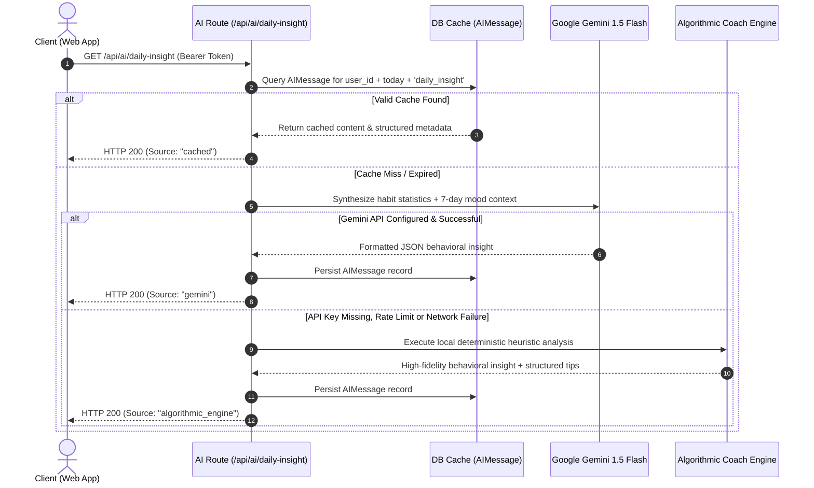
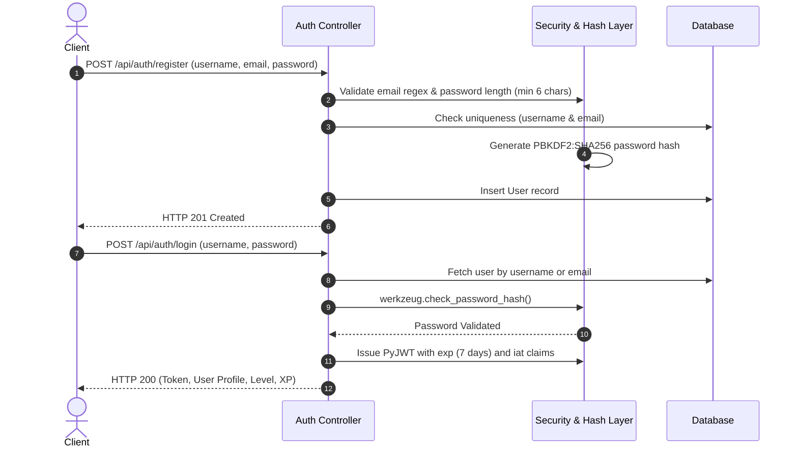
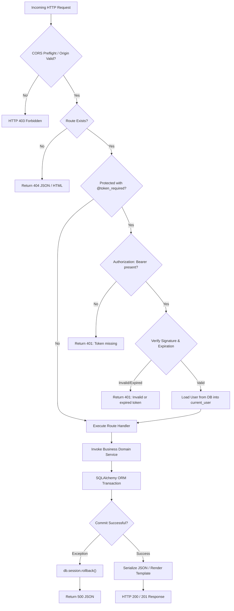
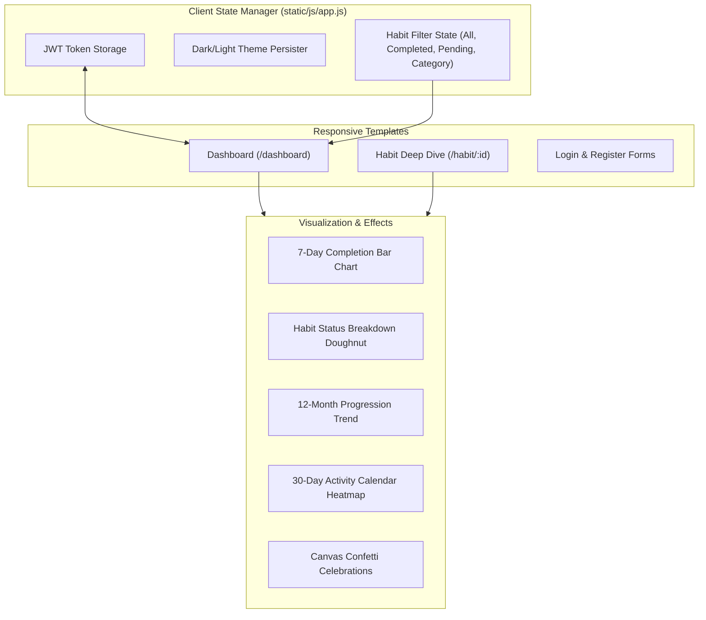
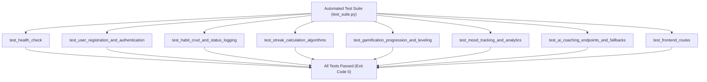

# HabitFlow

> **HabitFlow** is an enterprise-grade, gamified personal habit tracking application and behavioral analytics engine. It seamlessly combines behavioral science, streak intelligence, multi-metric analytics, mood correlation tracking, and AI-driven coaching (powered by Google Gemini with algorithmic fallback) to help individuals build sustainable lifelong routines.

---

## Table of Contents

1. [Executive Overview & Key Highlights](#executive-overview--key-highlights)
2. [High-Level System Architecture](#high-level-system-architecture)
3. [Component & Layered Architecture](#component--layered-architecture)
4. [Database Design & Entity-Relationship Model](#database-design--entity-relationship-model)
5. [Core Algorithms & Business Logic](#core-algorithms--business-logic)
   - [Streak Calculation Engine & Grace Periods](#streak-calculation-engine--grace-periods)
   - [Gamification, Experience (XP) & Leveling](#gamification-experience-xp--leveling)
   - [AI Coaching & Hybrid Fallback Engine](#ai-coaching--hybrid-fallback-engine)
   - [Mood-Habit Correlation Analytics](#mood-habit-correlation-analytics)
6. [Authentication, Security & Hardening](#authentication-security--hardening)
7. [End-to-End Request Lifecycle](#end-to-end-request-lifecycle)
8. [Comprehensive REST API Reference](#comprehensive-rest-api-reference)
9. [Frontend Architecture & User Experience](#frontend-architecture--user-experience)
10. [Automated Testing Suite](#automated-testing-suite)
11. [Installation, Configuration & Deployment](#installation-configuration--deployment)
12. [Repository Directory Structure](#repository-directory-structure)
13. [Authors and Connect](#authors-and-connect)
14. [Contributing & License](#contributing--license)

---

## Executive Overview & Key Highlights

HabitFlow was built from the ground up to solve the most common challenges in digital habit tracking: rigid streak breakages, lack of context between emotional state and productivity, and uninspired user retention.

### Key Capabilities

* **Schedule-Aware Streak Engine:** Automatically differentiates between daily, weekday-only, and custom-scheduled habits. An unlogged habit today never breaks a streak prematurely due to a built-in grace period window.
* **Dual-Tier AI Coaching:** Leverages Google Gemini 1.5 Flash to synthesize habit progress and mood entries into actionable psychological nudges. If an API key is absent or offline, an intelligent heuristic behavioral coach engine executes seamlessly with zero disruption.
* **Mood Correlation Engine:** Correlates emotional wellbeing (Happy, Good, Neutral, Low, Stressed) with habit execution rates, revealing which routines drive peak emotional performance.
* **Gamified Progression System:** Progression driven by deterministic Level curves ($\text{Level} = \lfloor \text{XP} / 100 \rfloor + 1$), rewarding habit completions, milestone streaks, and self-reflection check-ins.
* **XSS-Hardened Modern UI:** Built with responsive Bootstrap 5, dark mode persistence, Chart.js trend charts, activity heatmaps, live search filtering, and confetti particle animations.

---

## High-Level System Architecture

HabitFlow implements a decoupled, monolithic layered architecture designed for scalability, zero-downtime reliability, and straightforward deployment.



---

## Component & Layered Architecture

HabitFlow strictly adheres to the Separation of Concerns (SoC) principle:

```mermaid
flowchart LR
    subgraph Presentation ["1. Presentation Layer"]
        Views["Jinja2 Web Views (/dashboard, /habit/id, /login)"]
        StaticAssets["CSS Themes, Chart.js, app.js"]
    end

    subgraph API_Routers ["2. API & Routing Layer"]
        Routes["RESTful Blueprints (Auth, Habits, Mood, Analytics, AI)"]
        Validators["Input Validation & Bearer Header Inspection"]
    end

    subgraph Domain_Services ["3. Business Domain Services"]
        SE["Streak Engine"]
        GE["Gamification Engine"]
        CE["Algorithmic Coach Engine"]
        AI["Gemini LLM Client"]
    end

    subgraph Data_Access ["4. Data Access Layer"]
        Models["Declarative ORM Models (User, Habit, HabitLog, Mood, Badge)"]
        Transactions["Atomic Sessions & Auto-rollback Protections"]
    end

    Presentation --> API_Routers
    API_Routers --> Domain_Services
    Domain_Services --> Data_Access
    Data_Access --> Storage[("SQLite / MySQL Engine")]
```



1. **Presentation Layer:** Jinja2 templates serve semantic HTML5 views, while modern ES6 client JavaScript handles asynchronous API calls, DOM mutation with strict HTML escaping, and Chart.js state management.
2. **API & Routing Layer:** Modular Blueprints (`routes/`) validate incoming payloads, verify JWT signatures, enforce rate controls, and format RFC-compliant JSON responses.
3. **Domain Services Layer:** Dedicated, stateless utility classes (`services/`) encapsulate complex domain logic: streak windows, XP distribution, badge unlocking, and algorithmic fallback coaching.
4. **Data Access Layer:** Declarative SQLAlchemy models (`models.py`) with connection pooling, automatic indexation, cascade deletions, and database portability across SQLite and MySQL.

---

## Database Design & Entity-Relationship Model

The relational database schema is structured for referential integrity, performant querying on dates and user scopes, and automated badge seeding.



### Constraints & Indexes
* **`HABIT_LOGS`:** Unique composite constraint `(habit_id, date)` ensures each habit is logged at most once per calendar date.
* **`MOODS`:** Unique composite constraint `(user_id, date)` enforces a single primary daily emotional check-in per user.
* **`USER_BADGES`:** Unique composite constraint `(user_id, badge_id)` guarantees badge award idempotency.
* **`AI_MESSAGES`:** Unique composite constraint `(user_id, message_type, date)` guarantees single-generation daily caching, minimizing LLM token consumption.

---

## Core Algorithms & Business Logic

### Streak Calculation Engine & Grace Periods

Traditional streak trackers fail if a user checks their app at 9:00 PM without having logged that day yet. HabitFlow solves this through a **two-phase schedule-aware grace period algorithm**.



### Streak Engine Rules
1. **Grace Period on Current Date:** If the habit is scheduled for today but not yet logged, the streak from yesterday remains intact. The streak only resets if yesterday was scheduled and neither completed nor excused.
2. **Frequency Filtering:** If a habit is configured for Monday through Friday, Saturday and Sunday are excluded from the required verification window and will not disrupt streaks.
3. **Excused Skips:** Logs marked as `skipped` preserve current streak momentum without incrementing the streak count.

---

### Gamification, Experience (XP) & Leveling

HabitFlow rewards continuous engagement through a transparent gamification engine.



#### Deterministic Level Progression Formula
$$\text{Level} = \left\lfloor \frac{\text{Total XP}}{100} \right\rfloor + 1$$

* $\text{XP} \in [0, 99] \implies \text{Level } 1$
* $\text{XP} \in [100, 199] \implies \text{Level } 2$
* $\text{XP} \in [200, 299] \implies \text{Level } 3$

#### Seeded Badges
| Badge | Description | Trigger Threshold |
| :--- | :--- | :--- |
| **First Step** | Completed your first habit | 1 completion |
| **Consistent** | Completed 10 habits in total | 10 completions |
| **Centennial** | Completed 100 habit logs | 100 completions |
| **First Week** | Completed a habit for 7 days straight | 7-day streak |
| **Two Weeks Strong** | Maintained a 14-day consecutive streak | 14-day streak |
| **Monthly Master** | Completed a habit for 30 consecutive days | 30-day streak |
| **Centurion** | Maintained a 100-day legendary streak | 100-day streak |
| **Yearly Champion** | Maintained a 365-day streak | 365-day streak |

---

### AI Coaching & Hybrid Fallback Engine

HabitFlow incorporates a resilient multi-tier AI coaching infrastructure. Daily insights are cached in the database for 24 hours to optimize latency and minimize external LLM token consumption.



---

### Mood-Habit Correlation Analytics

The analytics engine bridges the gap between productivity metrics and emotional wellbeing. For any user, the system evaluates the historical coincidence of habit completions and mood states:

$$\text{Correlation Rate} = \min\left(100\%, \frac{\text{Completions on High-Mood Days}}{\max(1, \text{Total High-Mood Days})} \times 100\right)$$

* Detects user's **Power Days** (weekdays with statistically highest completion frequency).
* Detects **Comeback Opportunities** (encouraging recovery after missed habits).
* Correlates physical activity and mindfulness habits directly to mood elevation.

---

## Authentication, Security & Hardening

Security and defensive engineering are implemented at every layer:



### Security Hardening Measures
1. **Password Hashing:** Utilizes Werkzeug's secure PBKDF2 with SHA-256 and unique per-user salts. Plaintext passwords are never stored or logged.
2. **JWT Token Lifecycle:** Tokens are signed using HMAC-SHA256 (`HS256`), containing explicit `exp` (7-day validity) and `iat` timestamps. The `@token_required` decorator validates signatures and expiration on protected routes.
3. **Cross-Site Scripting (XSS) Mitigation:** All dynamic client DOM injections run through an HTML entity encoder (`escapeHtml`), preventing stored XSS from malicious habit titles or journal notes.
4. **SQL Injection Immunity:** All database operations utilize SQLAlchemy parameterized ORM queries; no raw SQL concatenations are used.
5. **CORS Configuration:** Explicitly controls allowable origins, request methods, and authorization headers via `Flask-CORS`.
6. **Graceful Error Masking:** Production exceptions are trapped by centralized HTTP handlers, preventing internal stack traces from leaking to clients.

---

## End-to-End Request Lifecycle



---

## Comprehensive REST API Reference

All protected API endpoints require the standard HTTP authorization header:
```http
Authorization: Bearer <your_jwt_token>
```

### 1. Authentication Endpoints

#### Register a New Account
```http
POST /api/auth/register
Content-Type: application/json

{
  "username": "sanyam",
  "email": "sanyam@example.com",
  "password": "SecurePassword123"
}
```
**Response (201 Created):**
```json
{
  "message": "User registered successfully!",
  "token": "eyJhbGciOiJIUzI1NiIsInR5cCI6IkpXVCJ9...",
  "user": {
    "id": 1,
    "username": "sanyam",
    "email": "sanyam@example.com",
    "xp": 0,
    "level": 1
  }
}
```

#### User Login
```http
POST /api/auth/login
Content-Type: application/json

{
  "username": "sanyam",
  "password": "SecurePassword123"
}
```
**Response (200 OK):**
```json
{
  "message": "Login successful!",
  "token": "eyJhbGciOiJIUzI1NiIsInR5cCI6IkpXVCJ9...",
  "user": {
    "id": 1,
    "username": "sanyam",
    "email": "sanyam@example.com",
    "xp": 140,
    "level": 2
  }
}
```

#### Fetch Current Profile
```http
GET /api/auth/profile
```
**Response (200 OK):**
```json
{
  "user": {
    "id": 1,
    "username": "sanyam",
    "email": "sanyam@example.com",
    "xp": 140,
    "level": 2,
    "created_at": "2026-10-01T12:00:00"
  },
  "stats": {
    "total_habits": 5,
    "active_habits": 5,
    "total_completions": 42,
    "longest_streak": 14,
    "badges_earned": 3
  }
}
```

---

### 2. Habits Endpoints

#### List All User Habits
```http
GET /api/habits
```
**Response (200 OK):**
```json
{
  "count": 1,
  "habits": [
    {
      "id": 1,
      "title": "Morning Meditation",
      "category": "health",
      "icon": "🧘",
      "color": "primary",
      "frequency": ["monday", "tuesday", "wednesday", "thursday", "friday"],
      "reminder_time": "07:30:00",
      "active": true,
      "current_streak": 5,
      "longest_streak": 12,
      "total_completions": 28,
      "consistency_score": 85.7,
      "completion_rate": 80.0,
      "is_scheduled_today": true,
      "today_status": "completed"
    }
  ]
}
```

#### Create a Habit
```http
POST /api/habits
Content-Type: application/json

{
  "title": "Read 20 Pages",
  "category": "learning",
  "icon": "📚",
  "color": "success",
  "frequency": ["monday", "wednesday", "friday", "sunday"],
  "reminder_time": "21:00"
}
```

#### Log Habit Action (Complete, Skip, Miss)
```http
POST /api/habits/1/complete
Content-Type: application/json

{
  "date": "2026-10-02",
  "notes": "Focused chapter on systems architecture."
}
```
**Response (200 OK):**
```json
{
  "message": "Habit completed! +10 XP earned.",
  "xp_earned": 10,
  "current_streak": 6,
  "longest_streak": 12,
  "user": {
    "xp": 150,
    "level": 2
  },
  "new_badges": []
}
```

---

### 3. Mood Tracking Endpoints

#### Check-in Daily Mood
```http
POST /api/mood
Content-Type: application/json

{
  "date": "2026-10-02",
  "mood": "happy",
  "energy": 5,
  "notes": "Felt productive, finished core refactoring."
}
```
**Response (201 Created):**
```json
{
  "message": "Mood logged successfully! +5 XP earned.",
  "mood": {
    "date": "2026-10-02",
    "mood": "happy",
    "energy": 5,
    "notes": "Felt productive, finished core refactoring."
  },
  "xp_earned": 5
}
```

---

### 4. AI Coaching Endpoints

#### Get Daily Personalized Insight
```http
GET /api/ai/daily-insight
```
**Response (200 OK):**
```json
{
  "insight": {
    "message": "Outstanding consistency! Your morning habits directly correlate with elevated focus.",
    "category": "momentum",
    "actionable_tip": "Prepare your workspace the night before to reduce friction tomorrow morning."
  },
  "source": "gemini",
  "date": "2026-10-02"
}
```

---

## Frontend Architecture & User Experience

The HabitFlow frontend is designed as a high-performance Single-Page-Feel interface that eliminates heavy framework dependencies in favor of native browser standards.



### Highlights of UI/UX Implementation
* **Zero XSS Exposure:** Every dynamic content rendering into `.innerHTML` passes through an HTML character entity encoder (`escapeHtml`), preventing injection vulnerabilities.
* **Instant Habit Search:** Client-side real-time fuzzy search responds immediately to keystrokes without reloading or re-fetching.
* **Smart Filter Tabs:** Filter active habits by status (`All`, `Pending Today`, `Completed Today`) and by category (`Health`, `Fitness`, `Learning`, `Productivity`).
* **Visual Data Density:** Combines Chart.js graphs, 30-day activity calendar heatmaps, and consistency percentage meters for instant status recognition.
* **Persistent Dark Mode:** Full dark mode theming configured via CSS variables and preserved across sessions via `localStorage`.

---

## Automated Testing Suite

HabitFlow includes a comprehensive unit and integration test suite (`test_suite.py`) covering all critical application subsystems.



### Running the Test Suite

```bash
# Activate your virtual environment
source venv/bin/activate

# Execute the test suite
python3 test_suite.py
```

### Verifying Code Quality and Linting

```bash
# Check for syntax errors, undefined names, and critical issues
flake8 . --count --select=E9,F63,F7,F82 --show-source --statistics
```

---

## Installation, Configuration & Deployment

### Quick Start (Local Development)

```bash
# 1. Clone repository
git clone https://github.com/KerberoSec/Sanyam_Hackathon_2nd_Rank.git
cd Sanyam_Hackathon_2nd_Rank

# 2. Run automated setup script (creates venv, installs dependencies, sets up .env)
chmod +x setup.sh
./setup.sh

# 3. Start the application
python3 app.py
```
Open [http://localhost:5000](http://localhost:5000) in your web browser.

---

### Environment Configuration (`.env`)

| Variable | Type | Default Value | Description |
| :--- | :--- | :--- | :--- |
| `FLASK_ENV` | String | `development` | Flask runtime environment (`development` or `production`) |
| `SECRET_KEY` | String | `dev-secret-key-change...` | Secret key used for session cookie signing |
| `JWT_SECRET_KEY` | String | `dev-jwt-secret-key...` | Cryptographic secret for signing JWT tokens |
| `DATABASE_URL` | String | `sqlite:///instance/habit_tracker.db` | SQLAlchemy connection URI (SQLite or MySQL) |
| `GEMINI_API_KEY` | String | `""` | Optional Google Gemini API key for LLM-driven coaching |
| `DEBUG` | Integer | `1` | Enable or disable Flask interactive debugger |

---

### Running with Docker & Docker Compose

Deploy HabitFlow with a single command using Docker Compose:

```bash
# Build and launch container in detached mode
docker compose up -d --build

# Inspect application container logs
docker compose logs -f habitflow

# Tear down container services
docker compose down
```

The containerized app includes health checks, persistent data volumes, and automatically mounts the SQLite instance directory.

---

### Production Deployment (Gunicorn + Nginx)

For high-concurrency production deployments:

```bash
# Install Gunicorn WSGI server
pip install gunicorn

# Launch application with 4 worker processes
gunicorn -w 4 -b 0.0.0.0:5000 "app:create_app()"
```

#### Sample Nginx Reverse Proxy Configuration
```nginx
server {
    listen 80;
    server_name habits.yourdomain.com;

    location / {
        proxy_pass http://127.0.0.1:5000;
        proxy_set_header Host $host;
        proxy_set_header X-Real-IP $remote_addr;
        proxy_set_header X-Forwarded-For $proxy_add_x_forwarded_for;
        proxy_set_header X-Forwarded-Proto $scheme;
    }
}
```

---

## Repository Directory Structure

```plaintext
HabitFlow/
├── app.py                     # Centralized application factory & error handlers
├── config.py                  # Environment-driven configuration & DB URI resolution
├── models.py                  # SQLAlchemy declarative models & badge seed logic
├── requirements.txt           # Production Python dependency manifest
├── Dockerfile                 # Container image specification (Python 3.11-slim)
├── docker-compose.yml         # Container orchestration with volume mounts
├── setup.sh                   # One-click environment bootstrap script
├── test_suite.py              # Automated unit and integration test suite
├── README.md                  # Comprehensive architectural and system documentation
├── routes/                    # Modular REST Blueprint Controllers
│   ├── __init__.py            # Blueprint registry and package exports
│   ├── auth.py                # Registration, login, profile, and JWT issuance
│   ├── habits.py              # Habit CRUD, frequency verification, and action logs
│   ├── analytics.py           # Dashboard metrics, trends, and habit deep dives
│   ├── mood.py                # Mood check-ins, streaks, and correlation analytics
│   └── ai.py                  # AI coaching endpoints and response caching
├── services/                  # Business Logic & Behavioral Domain Engines
│   ├── __init__.py            # Service layer registry and package exports
│   ├── streak_engine.py       # Schedule-aware streak calculation engine
│   ├── gamification.py        # XP formulas, leveling curves, and badge criteria
│   ├── coach_engine.py        # Algorithmic behavioral psychology heuristics
│   └── ai_coach.py            # Google Gemini client with fallback integration
├── static/                    # Frontend Client Static Assets
│   ├── css/
│   │   └── style.css          # Core styles, dark mode themes, animations
│   └── js/
│       ├── app.js             # Consolidated frontend application logic & API client
│       └── dashboard.js       # Backwards-compatibility adapter
└── templates/                 # Jinja2 Semantic HTML Templates
    ├── base.html              # Base layout with responsive navigation & theme toggle
    ├── index.html             # Landing page with interactive hero and feature showcases
    ├── login.html             # Authentication: User sign-in
    ├── register.html          # Authentication: New user registration
    ├── dashboard.html         # Main dashboard with stats, habit list, AI coach & charts
    └── habit_detail.html      # Habit deep-dive with calendar heatmap & edit modal
```

---

## Authors and Connect

Developed and maintained by **Arun Kumar**, **Sourav**, **Anish Thakur**, and **Paras Rana**.

### Custom Development & Consulting
We design and build institutional-grade web applications, behavioral analytics platforms, custom gamification engines, high-performance productivity systems, and secure full-stack infrastructure tailored to your specific product requirements.

* **Full-Stack Web & Mobile Applications:** Modern, responsive web and cross-platform applications built with robust backend frameworks (Python/Flask, FastAPI, Node.js), dynamic interactive frontends (Vanilla ES6, React, Vue, Bootstrap 5), and intuitive, user-centric UX/UI design.
* **Gamification & Behavioral Analytics Systems:** Custom XP progression algorithms, streak verification engines with grace-period logic, badge unlocking mechanisms, and interactive data visualizations (Chart.js, D3.js) designed to maximize engagement and habit retention.
* **Real-Time Data Pipelines & Analytics:** Event-driven architectures, automated report generation, data aggregation engines, multi-tier database caching, and custom background processing services for reliable operations.
* **Scalable Backend APIs & Database Architecture:** High-performance RESTful and GraphQL APIs, relational database modeling (PostgreSQL, MySQL, SQLite), connection pooling, atomic transactions, and automated Dockerized container deployments.
* **Security, Hardening & Defensive Engineering:** Enterprise-grade security audits, JWT authentication lifecycles with cryptographically signed tokens, PBKDF2/Argon2 password hashing, strict context-aware XSS/CSRF mitigations, and OWASP Top-10 compliance.

If you need a custom web application, gamified productivity tool, data analytics platform, or scalable backend infrastructure built according to your needs, feel free to reach out and connect.

### Connect

[](https://www.linkedin.com/in/arunkumar31072006/)
[](https://github.com/KerberoSec)
[](https://www.instagram.com/so_far_from_your_heart/)
[](https://x.com/ArunKumar310706)

| Platform | Profile Link | Handle |
| :--- | :--- | :--- |
| **LinkedIn** | [linkedin.com/in/arunkumar31072006](https://www.linkedin.com/in/arunkumar31072006/) | [Arun Kumar](https://www.linkedin.com/in/arunkumar31072006/) |
| **GitHub** | [github.com/KerberoSec](https://github.com/KerberoSec) | [@KerberoSec](https://github.com/KerberoSec) |
| **Instagram** | [instagram.com/so_far_from_your_heart](https://www.instagram.com/so_far_from_your_heart/) | [@so_far_from_your_heart](https://www.instagram.com/so_far_from_your_heart/) |
| **X / Twitter** | [x.com/ArunKumar310706](https://x.com/ArunKumar310706) | [@ArunKumar310706](https://x.com/ArunKumar310706) |

---

## Contributing & License

Contributions are welcome! Please feel free to submit a Pull Request or open an Issue.

This project is licensed under the MIT License, see the [LICENSE](LICENSE) file for details.
